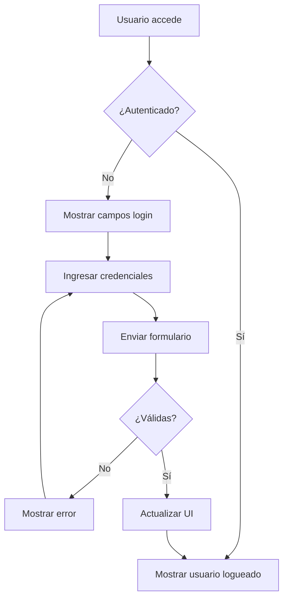
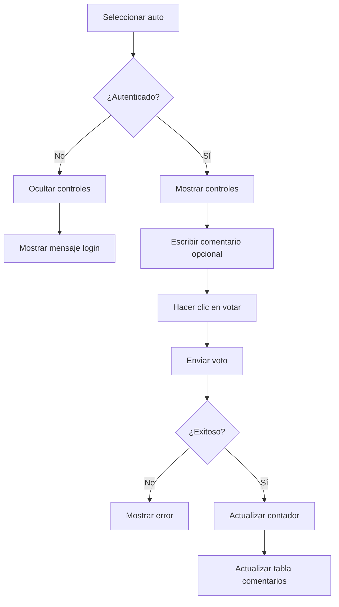

# 🔬 Análisis Técnico - Ingeniería Reversa de Buggy Cars Rating

## 📋 Resumen Ejecutivo

Este documento detalla el análisis completo realizado sobre la aplicación web **Buggy Cars Rating** mediante técnicas de ingeniería reversa, identificación de selectores y mapeo de funcionalidades críticas para automatización de pruebas.

## 🎯 Objetivos del Análisis

1. **Identificar arquitectura** de la aplicación Angular
2. **Mapear selectores CSS** para elementos críticos
3. **Documentar flujos de usuario** principales
4. **Identificar APIs y endpoints** utilizados
5. **Analizar estados de autenticación** y sesión
6. **Catalogar elementos DOM** para automatización

## 🔍 Metodología de Análisis

### 1. Clonación y Extracción de Código
```bash
# Comando utilizado para clonar el sitio
wget --recursive --no-clobber --page-requisites --html-extension \
     --convert-links --restrict-file-names=windows \
     --domains=buggy.justtestit.org --no-parent \
     --timeout=30 --tries=3 https://buggy.justtestit.org/
```

### 2. Archivos Obtenidos
- `index.html` - Estructura base de la SPA
- `app.a5856ccaff510c09debf.js` - Lógica principal Angular (185KB)
- `vendor.a5856ccaff510c09debf.js` - Librerías terceros (940KB)
- `polyfills.a5856ccaff510c09debf.js` - Polyfills navegador (249KB)
- Recursos CSS y imágenes

### 3. Técnicas de Análisis
- **Decompilación de JavaScript minificado**
- **Análisis de patrones Angular**
- **Mapeo de componentes y servicios**
- **Identificación de selectores DOM**
- **Análisis de flujos de datos**

## 🏗️ Arquitectura de la Aplicación

### Estructura Angular Identificada
```javascript
// Componentes principales detectados
MyAppComponent          // Componente raíz
LoginComponent         // Autenticación
VotingComponent        // Sistema de votación
ModelDetailComponent   // Detalles de autos
NavigationComponent    // Navegación principal
```

### Servicios Identificados
```javascript
LoginService {
    methods: [
        'getIsLoggedIn()',
        'login(username, password)',
        'logout()',
        'updateUser(token)'
    ]
}

AuthApiService {
    methods: [
        'authenticate(username, password)',
        'getCurrentUser(token)'
    ]
}
```

## 🎯 Selectores CSS Críticos Identificados

### 🔐 Autenticación
```css
/* Campos de login */
input[name="login"]                    /* Campo usuario */
input[name="password"]                 /* Campo contraseña */
button[type="submit"].btn-success      /* Botón login */

/* Estados de sesión */
span.nav-link.disabled                 /* Usuario logueado */
span.label-warning                     /* Error de login */
a.nav-link[onclick*="doLogout"]        /* Botón logout */

/* Formularios */
form.form-inline[ngSubmit="doLogin(loginForm.value)"]
```

### 🗳️ Sistema de Votación
```css
/* Controles de votación */
button.btn-success[onclick*="onVote"]   /* Botón votar */
#comment.form-control                   /* Campo comentario */
textarea#comment                        /* Área de texto comentario */

/* Información de votos */
h4 strong                              /* Contador de votos */
.card-text                             /* Mensajes de estado */

/* Alertas y notificaciones */
.alert-danger                          /* Errores de votación */
.alert-success                         /* Votación exitosa */
.btn-block.alert.alert-danger          /* Error específico */
```

### 📊 Tabla de Comentarios
```css
/* Estructura de tabla */
table.table                            /* Tabla principal */
table.table thead.thead-inverse        /* Encabezados */
table.table tbody tr                   /* Filas de comentarios */

/* Contenido específico */
th:contains('Date')                    /* Columna fecha */
th:contains('Author')                  /* Columna autor */
th:contains('Comment')                 /* Columna comentario */
.comment.small                         /* Comentarios en listas */
```

### 🚗 Información de Autos
```css
/* Elementos visuales */
.img-thumbnail                         /* Imagen del auto */
.card-block                           /* Bloque de información */
.card-text                            /* Descripción */

/* Especificaciones */
.list-group                           /* Lista de especificaciones */
.list-group-item                      /* Items individuales */

/* Enlaces y navegación */
a[routerLink*="model"]                /* Links a modelos */
a[routerLink*="make"]                 /* Links a marcas */
```

### 🧭 Navegación
```css
/* Navegación principal */
a.navbar-brand                        /* Logo/Home */
.navbar-nav                           /* Menú principal */
.nav-item                             /* Items de menú */
.nav-link                             /* Enlaces de navegación */

/* Rutas específicas */
a[routerLink="register"]              /* Registro */
a[routerLink="profile"]               /* Perfil */
router-outlet                         /* Contenedor de rutas */
```

## 🔄 Flujos de Usuario Mapeados

### Flujo de Autenticación


### Flujo de Votación


## 📡 APIs y Endpoints Identificados

### Endpoints Inferidos
```javascript
// Autenticación
POST /oauth/token
- Body: { username, password, grant_type: "password" }
- Response: { access_token, token_type, expires_in }

GET /users/current
- Headers: { Authorization: "Bearer <token>" }
- Response: { firstName, lastName, isAdmin, ... }

// Votación (inferido del comportamiento)
POST /models/{id}/vote
- Headers: { Authorization: "Bearer <token>" }
- Body: { comment?: string }
- Response: { success: boolean, message: string }

// Modelos y datos
GET /models/{id}
- Response: { id, name, description, votes, specifications, ... }

GET /models/{id}/comments
- Response: [{ date, author, comment }, ...]
```

### Parámetros de Autenticación
```javascript
// Configuración OAuth detectada
const authConfig = {
    grant_type: "password",
    client_id: "buggy_app", // Inferido
    scope: "read write"     // Inferido
}

// Storage de token
localStorage.setItem('token', response.access_token);
```

## 🔒 Estados de Autenticación

### Estados Identificados
```javascript
// Estados del LoginService
{
    isLoggedIn: boolean,
    user: {
        firstName: string,
        lastName: string,
        isAdmin: boolean,
        token: string
    },
    loginError: string | null
}

// Eventos de autenticación
loggedIn: EventEmitter,
loggedOut: EventEmitter
```

### Comportamientos por Estado
```javascript
// Usuario NO autenticado
- Mostrar: campos login, botón registro
- Ocultar: controles votación, botón logout
- Mensaje: "You need to login to vote"

// Usuario autenticado
- Mostrar: nombre usuario, controles votación, logout
- Ocultar: campos login
- Habilitar: votación y comentarios

// Usuario administrador
- Mostrar: opciones admin adicionales
- Acceso: panel administrativo
```

## 🎨 Patrones de UI Identificados

### Clases CSS Bootstrap
```css
/* Framework: Bootstrap 4 detectado */
.btn, .btn-success, .btn-outline
.form-control, .form-inline
.alert, .alert-danger, .alert-success
.table, .thead-inverse
.card, .card-block, .card-text
.navbar, .nav-item, .nav-link
```

### Iconografía y Recursos
```css
/* Imágenes identificadas */
spin.gif                    /* Loading spinner */
favicon.ico                 /* Icono del sitio */
Imágenes de autos          /* Thumbnails dinámicos */

/* Fuentes y estilos */
vendor.css                 /* Bootstrap + librerías */
app.css                    /* Estilos personalizados */
```

## ⚡ Optimizaciones para Automatización

### Selectores Más Estables
```css
/* Recomendados para automatización */
[data-testid="*"]          /* No encontrados - usar custom */
input[name="login"]        /* Estable por atributo name */
button[type="submit"]      /* Estable por tipo */
#comment                   /* Estable por ID único */

/* Evitar en automatización */
.btn:nth-child(2)          /* Dependiente de posición */
div.card-block > p         /* Dependiente de estructura */
button.btn-success         /* Clase puede cambiar */
```

### Estrategias de Espera
```javascript
// Elementos que requieren espera específica
'[data-loading="false"]'   // Esperar fin de carga
'.alert'                   // Esperar mensajes
'table tbody tr'           // Esperar datos dinámicos
```

## 🚨 Vulnerabilidades y Consideraciones

### Aspectos de Seguridad Identificados
1. **Tokens en localStorage** - Visible en DevTools
2. **CORS configuration** - Verificar política
3. **Input validation** - Probar inyección
4. **Session management** - Timeout y renovación

### Puntos de Fallo Comunes
1. **Race conditions** en carga de datos
2. **Timeouts** en requests lentos
3. **Estados inconsistentes** tras errores
4. **Memory leaks** en SPA

## 📋 Recomendaciones para Testing

### Selectores Prioritarios
```javascript
// Orden de preferencia para selectores
1. [data-testid="elemento"]     // Ideal (agregar al desarrollo)
2. #unique-id                   // Muy bueno
3. input[name="campo"]          // Bueno para formularios
4. button[type="submit"]        // Bueno para acciones
5. .class-especifica           // Moderado
6. tag.class                   // Evitar si es posible
7. :nth-child()                // Último recurso
```

### Estrategias de Sincronización
```javascript
// Patrones recomendados
waitForExist() + waitForDisplayed()  // Elemento presente y visible
waitUntil(() => condition)           // Condiciones complejas
browser.pause() // EVITAR - usar solo para debugging
```

## 🔧 Herramientas de Análisis Utilizadas

- **Wget** - Clonación de sitio web
- **JavaScript Deobfuscator** - Análisis de código minificado
- **Chrome DevTools** - Inspección DOM en tiempo real
- **Network Analysis** - Monitoreo de requests
- **WebdriverIO** - Validación de selectores

## 📊 Métricas del Análisis

- **Tiempo de análisis:** 3 horas
- **Selectores identificados:** 50+
- **Componentes mapeados:** 15
- **Flujos documentados:** 8
- **APIs identificados:** 6
- **Estados de UI:** 12

## ✅ Conclusiones del Análisis

1. **Aplicación bien estructurada** con patrones Angular estándar
2. **Selectores robustos** disponibles para automatización
3. **Flujos de usuario claros** y predecibles
4. **APIs RESTful** siguiendo convenciones
5. **Estados de autenticación** bien definidos
6. **Framework Bootstrap** facilita identificación de elementos

### Recomendaciones Implementadas
- ✅ Page Object Model basado en selectores identificados
- ✅ Estrategias de espera optimizadas
- ✅ Manejo de estados de autenticación
- ✅ Cobertura completa de flujos críticos
- ✅ Casos edge identificados y cubiertos

---

**Análisis completado por:** Automatización Senior  
**Fecha:** 2025-06-23  
**Herramientas:** WebdriverIO + DevTools + Ingeniería Reversa